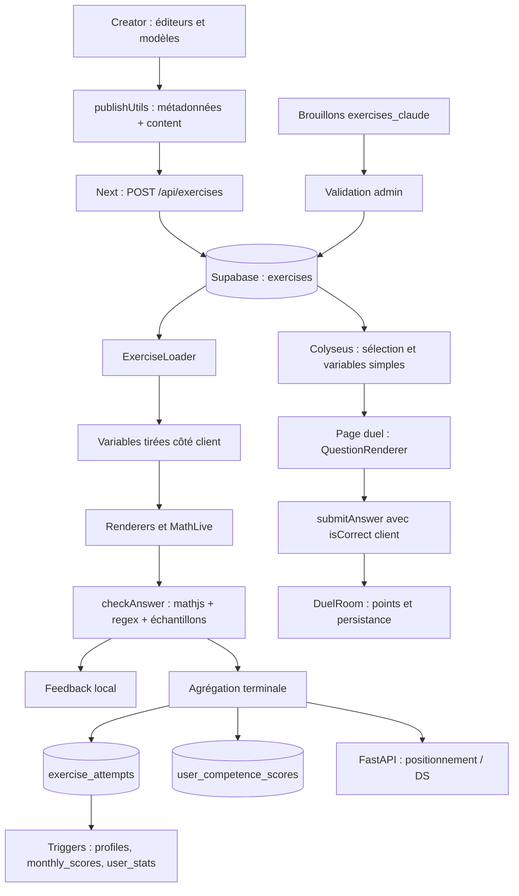

# 01 — Architecture actuelle de la correction

Audit du 9 octobre 2026. Révision Novlearn : `907fb09`. Lecture du dépôt principal et du dépôt voisin `../Novlearn Creator/`, dont les consignes `AGENTS.md` ont été lues. Aucune modification applicative, publication, migration ou écriture distante réalisée. Les résultats des sondes sont consignés dans [04](test-coverage-and-regressions.md).

## Périmètre et degré de certitude

**Observé** : code, migrations versionnées, modèles d'auteur et fixtures synthétiques, tests locaux. **Non observé** : catalogue réel Supabase, schéma/policies/triggers effectivement déployés, application Creator déployée et comportement d'un navigateur en session élève. Aucun export ni secret local n'a été lu. Aucun accès Supabase ciblé n'a été établi pour cet audit. Les schémas ci-dessous décrivent les migrations, pas une introspection de production. Aucun exercice publié précis ne peut donc être déclaré affecté ni quantifié.

Les documents `ARCHITECTURE.md` et `AGENTS.md` sont utiles mais parfois dépassés : le JSON exploité est `exercises.content.variables/elements`, et `backend/main.py` assemble désormais des routers. `sequence` et `discrete_graph` existent dans les types TypeScript mais pas dans le dispatcher effectif.

## Technologies effectivement utilisées

| Partie | Technologie observée | Rôle |
|---|---|---|
| Élève | Next.js ^15.5.12, React ^18.3.1, TypeScript, Tailwind 3, Zustand | App Router ; saisie, correction et persistance directe |
| Maths élève | mathjs ^15.1.0, installé 15.1.1 ; MathLive ^0.102.0 | Évaluation numérique, parsing, simplification d'affichage ; saisie LaTeX |
| Affichage élève | KaTeX 0.16.9 chargé par CDN dans `frontend/app/layout.tsx` | Rendu ; aucune validation mathématique |
| API | FastAPI 0.128.0, Pydantic 2.12.0, client Supabase 2.27.1 déclarés | Recommandations, positionnement, DS, lobby ; pas de CAS |
| Duel | Colyseus ^0.17.0 et Supabase JS | Timers et attribution des points ; aucune comparaison serveur |
| Creator voisin | React ^19.2.0, Vite ^7.2.1, Tailwind 4, KaTeX ^0.16.25 | Édition et prévisualisation ; parseur maison et fonctions JavaScript |
| Données | PostgreSQL/Supabase, JSONB et migrations SQL | Stockage, RLS, agrégats et triggers |

Sources : `frontend/package.json`, `backend/requirements.txt`, `duel-server/package.json`, `../Novlearn Creator/package.json`. SymPy, Cortex Compute Engine et un service de correction externe ne sont pas utilisés dans le code inspecté.

## Carte des composants : Creator

Les chemins `../Novlearn Creator/…` sont relatifs à la racine Novlearn et désignent un dépôt distinct.

| Fichier et fonctions | Entrées → sorties ; dépendances | Appelants et importance |
|---|---|---|
| `../Novlearn Creator/src/hooks/useExercises.js` — `createEmptyExercise`, `normalizeExercise`, `useExercises` | Objet importé → exercice aplati ; défauts, alias `variableDefinitions/app_title/apptitle`, IDs numériques | App, import et CRUD de blocs ; contrat d'auteur central |
| `../Novlearn Creator/src/utils/defaultContent.js` — `getDefaultContent` | Type → clone JSON du modèle | `useExercises.addElement` ; premières conventions de réponse |
| `../Novlearn Creator/src/editors/QuestionEditor.jsx`, `MCQEditor.jsx`, `EquationEditor.jsx` | Champs auteur → `content` | `ElementEditor.jsx` ; définissent les réponses et options |
| `../Novlearn Creator/src/components/VariableManager.jsx`, `src/hooks/useVariables.js` | Bornes, choix, expressions, exclusions **chaînes** → définitions et valeurs prévisualisées | App/preview ; `generateRandomValues` |
| `../Novlearn Creator/src/utils/generateRandomValues.js` — `generateRandomValues`, `replaceMathFunctions` | Définitions → scope ; tirages, 50 retries, 10 passes computed | `useVariables` ; dépend de `mathModules`, exécution par `new Function` |
| `../Novlearn Creator/src/utils/mathmodules.js` — `mathModules` | Arguments → discriminant, racines, sommet, solveur sécant, dérivée numérique, PGCD/PPCM, etc. | Générateur computed et aide auteur ; fonctions absentes du moteur élève |
| `../Novlearn Creator/src/utils/evaluateExpression.js` — `evaluateExpression` | Expression + scope → chaîne substituée ; négatifs parenthésés | `mathExpr`, graphes ; substitution destinée au calcul |
| `../Novlearn Creator/src/utils/mathExpr.js` — `preprocessLatex`, tokenizer/parser privés, `compileExpression`, `evalMath` | LaTeX/texte + scope → closure numérique ou NaN ; fonctions autorisées maison | Graph, DiscreteGraph, Vector, ComplexPlane ; pas un correcteur de réponses |
| `../Novlearn Creator/src/utils/mathRenderer.jsx` — `replaceVariables`, `MathText` | Texte/LaTeX + scope → JSX KaTeX ; arrondi 4 décimales | Tous renderers ; distinct du calcul |
| `../Novlearn Creator/src/renderers/QuestionRenderer.jsx` — `getFormattedSolution` | Solution → affichage ; `vide/inf/U` deviennent symboles | Preview ; champ élève désactivé, aucune correction interactive |
| `../Novlearn Creator/src/renderers/MCQRenderer.jsx` — `isOptionCorrect` | Options modernes ou anciennes → feedback par option | Preview ; accepte plus d'alias que l'app |
| `../Novlearn Creator/src/renderers/ElementRenderer.jsx` — `RENDERERS` | Type + contenu → renderer | ExercisePreview ; 12 types, divergents de l'élève |
| `../Novlearn Creator/src/utils/publishUtils.js` — `publishExerciseToDB`, `fetchFullExercise`, `fetchExercisesList` | Exercice aplati → métadonnées + `content` ; HTTP | Header/ImportModal ; validation de présence seulement, aucune certification mathématique |

`QuestionEditor` expose number/set/interval/expression/text et des points. Le défaut de nouvelle question est un ensemble `@x1; @x2`. Le modèle equation ne définit qu'un affichage. Les types vector/complexPlane servent à visualiser des objets, pas à valider des réponses vectorielles/complexes.

## Carte des composants : application élève

| Fichier et fonctions | Entrées → sorties ; dépendances | Appelants / importance |
|---|---|---|
| `frontend/app/types/exercise.ts` — `Exercise`, `Variable`, `AnswerFormat` | Contrats TypeScript, sans validation runtime | Loader, renderers, utilitaires ; sept formats déclarés |
| `frontend/app/components/Exercise/ExerciseLoader.tsx` — `loadExercise`, `handleElementSubmit`, `saveExerciseAttempt`, `updateCompetenceScore` | Ligne DB → exercice + variables ; callbacks → booléen global et writes | Pages exercices et DS ; chargement, abandon, navigation, scores, feedback : forte concentration |
| `frontend/app/components/Exercise/ExerciseRenderer.tsx` — `ElementRenderer`, `ExerciseRenderer` | Exercice + valeurs → renderers et callback `(id,answer,isCorrect)` | Loader ; dispatcher, sans correction propre |
| `frontend/app/renderers/QuestionRenderer.tsx` — `handleSubmit` | Valeur MathLive → booléen terminal ; `checkAnswer`, simplification, audio | Dispatcher et duel ; 2 essais par défaut ; seul résultat terminal remonte |
| `frontend/app/renderers/EquationRenderer.tsx` — `handleSubmit` | Champ texte → booléen ; alias numeric → number | Dispatcher ; 1 essai ; si correction absente, callback true |
| `frontend/app/renderers/MCQRenderer.tsx` — `shuffleArray`, `handleValidate` | Ensemble d'indices mélangés → booléen tout-ou-rien | Dispatcher ; options.correct ; callback ne transporte que le premier indice |
| `frontend/app/components/ui/MathInput.tsx` — `handleInput` | `math-field.value` → chaîne ; MathLive | QuestionRenderer ; pas de limite de longueur ni parsing métier |
| `frontend/app/utils/math/evaluation.ts` — `toMathJsSyntax`, `evaluate`, `checkAnswer`, `checkExpression/Interval/Set/Fraction` | Texte + variables + format → number/NaN ou booléen | Renderers, générateur, graphe, duel ; moteur effectif |
| `frontend/app/utils/math/parsing.ts` — `substituteVariables`, `parseMathText` | Templates → chaînes formatées/segments ; formatting | Évaluation, simplification et rendu ; partage dangereux calcul/affichage |
| `frontend/app/utils/math/formatting.ts` — `formatValue`, `cleanMathExpression` | Valeurs → arrondi 4 décimales ; chaîne → réécritures regex | Parsing ; peut changer la sémantique |
| `frontend/app/utils/math/simplification.ts` — `simplifyLatexExpression`, helpers numériques | Réponse attendue → LaTeX simplifié ; mathjs, parsing | Questions, équations, légende graphe ; affichage uniquement en pratique |
| `frontend/app/utils/variableGenerator.ts` — `generateVariables`, `evaluateExclusion`, `evaluateComputedExpression` | Définitions → tirages non reproductibles ; exclusions et computed | Loader ; support plus riche que duel, distinct de Creator |
| `frontend/app/lib/competenceScore.ts` — `computeNewScore`, `difficultyToLevel`, `getBonusStreak` | Points/max/difficulté/streak précédent → points plafonnés | Loader ; aucune baisse des points |
| `frontend/app/renderers/GraphRenderer.tsx` — `compileExpression`, `resolveStaticBound`, `computeBounds` | Expressions → fonctions compilées/échantillons/bornes | Dispatcher ; renseigne l'énoncé, ne corrige pas |
| `frontend/app/renderers/TextRenderer.tsx`, `SignTableRenderer.tsx`, `VariationTableRenderer.tsx` | Contenus + valeurs → rendu | Dispatcher ; affichage, pas saisie/correction |
| `frontend/app/components/ui/MathText.tsx`, `Latex.tsx`, `katexUtils.ts` | Templates → DOM KaTeX | Tous rendus ; `toLatex`, substitution ; erreurs visuelles non bloquantes |
| `frontend/app/lib/exerciseUtils.ts`, `services/taxonomyService.ts`, `store/useTaxonomyStore.ts` | Difficultés/chapitres/compétences → aliases, max_points, cache | TrainingPage, Loader ; configuration indirecte des points |
| `frontend/app/lib/supabase.ts`, `contexts/AuthContext.tsx`, `frontend/middleware.ts` | Config/session → client, identité, refresh | Chargements/writes ; authentification distincte de vérité mathématique |
| `frontend/app/lib/api.ts` — `postChapterTestNext`, `dsApi.submitDSAnswer` | Résultats client → requêtes FastAPI | Pages exercices/DS ; transmet succès, pas réponse mathématique |

## Carte serveur et stockage

| Fichier / fonction | Entrées → sorties ; appels et dépendances |
|---|---|
| `frontend/app/api/exercises/route.ts` — GET/POST | GET aplatit le JSON ; POST upsert du body après secret admin. Appelé par publishUtils ; pas de schéma métier. GET ne vérifie pas explicitement l'auth dans ce handler. CORS ne constitue pas une authentification. |
| `frontend/app/api/admin/claude-exercises/route.ts` — POST | Après contrôle admin, copie un brouillon exercises_claude dans exercises puis supprime le brouillon ; pas de vérification de calcul. `frontend/app/validation/page.tsx` exploite la prévisualisation. |
| `backend/main.py` — app / include_router | FastAPI, auth/config/lifespan ; assemble les routers ; aucune évaluation symbolique. |
| `backend/routers/recommendation.py` — recommend_exercise, chapter_test_next | Recommandation / POST `/api/chapter-test/next` ; succès fourni par client → prochaine question/points. |
| `backend/chapter_placement_test.py` — `fetch_or_start_test`, `get_next_test_exercise`, `_apply_scoring`, `_upsert_score` | État en profiles, compétences et last_success → positionnement adaptatif + points ; Supabase. |
| `backend/recommandation.py` — `recommander_exercice`, `backend/chapter_selection.py` | Scores/compétences/streak → ID recommandé ; consomment des résultats sans vérifier leur justesse. |
| `backend/streak.py` — `compute_streak` | Historique trié, chapitre optionnel → série signée ; lu par recommandation. |
| `backend/routers/ds.py` — `ds_submit`, `backend/schemas.py` — `SubmitDSAnswerRequest` | POST `/api/ds/{ds_id}/submit` ; exercice_id, compétences, difficulté et booléen ; authentifie propriétaire DS mais n'évalue rien. |
| `backend/ds.py` — `soumettre_reponse_ds` | Booléen/difficulté → scores et streak DS ; appelé par router ; exercice_id n'est pas utilisé pour certifier la soumission. |
| `duel-server/src/rooms/DuelRoom.ts` — `handleSubmitAnswer`, `broadcastExercise`, `getCorrectAnswerPayload` | Message client → point/transition ; auth joueur, timers ; fait confiance à isCorrect. |
| `duel-server/src/db.ts` — `getRandomExercise`, `generateVariables`, `recordAttempt`, `saveDuelResult` | Exercices flash sans calculatrice → ligne complète + entiers/décimaux ; stores réponses brutes/booleans ; client service. |
| `duel-server/src/rooms/schema/DuelState.ts`, `src/config.ts` | Scores/phase/timing synchronisés ; pas de correction. |
| `scripts/sync-catalog.mjs` | Copie catalogue, préserve JSON ; ne valide pas les réponses. Non exécuté contre une DB distante. |

Les routes Next d'exercices et les routes FastAPI partagent `/api`. `frontend/next.config.mjs` proxy l'API en développement ; vérifier le routage réel côté Apache avant de brancher Creator sur un nouvel endpoint.

Schémas : `supabase/migrations/001_initial_schema.sql` définit exercises.content JSONB et exercise_attempts ; `021_exercises_and_attempts_columns.sql` ajoute métadonnées, flags avec majuscules et score ; `004_competences_and_scores.sql` et `006_fix_exercise_attempts_and_scores.sql` couvrent les scores ; `017_ds_feature.sql` couvre DS ; `002_friends_and_duels_system.sql` et `003_duel_attempts_element_id_bigint.sql` couvrent duel ; `019_remove_chapter_test_tables.sql` retire anciennes tables de positionnement ; `042_is_abandoned.sql` ajoute abandon ; `043_fix_exercise_attempts_fk.sql` couvre FK historique. Il n'existe pas de contrainte JSON métier attestant une réponse valide.

`025_rls_security_overhaul.sql` autorise les écritures personnelles de scores/résultats, pas une preuve de correction. La policy permissive FOR ALL `No guest access…` mérite une revue dédiée : son prédicat n'exprime pas la propriété des lignes et ne rend pas les autres policies plus restrictives. Incidence réelle à vérifier sur le schéma déployé.

## Parcours complet et sources de vérité

**Pratique** : Creator stocke des templates. Loader les charge depuis Supabase, génère les paramètres, rend les blocs. MathLive fournit LaTeX pour les questions ; equation utilise un input texte. checkAnswer normalise/évalue dans le navigateur ; QCM compare options.correct. Les renderers donnent du feedback. Loader attend les callbacks terminaux, considère l'exercice réussi si aucun callback faux et persiste **une ligne globale**, sans réponse brute ni variables. Les compétences sont actualisées si shouldCountPoints. Le premier essai faux suivi d'un succès ne rend pas forcément l'exercice faux.

**Positionnement** : `frontend/app/exercices/page.tsx.handleNextClick` envoie !hasErrors ; le backend applique ses propres barèmes adaptatifs. **DS** : `frontend/app/ds/[id]/exercices/page.tsx.handleNextClick` envoie le même agrégat, les compétences et la difficulté ; Loader persiste aussi l'historique global. **Duel** : `frontend/app/duel/active/[id]/page.tsx` n'affiche que text/question ; adapte answer/correctAnswer et answerType/answerFormat/numeric, précalcule la solution numérique si possible, transmet le verdict client. Le serveur marque le joueur comme ayant résolu **l'exercice** après un seul message vrai, même si plusieurs questions existent.

Source de vérité des **réponses attendues** : templates content.correctAnswer, anciens content.answer dans le duel, ou options.correct. Source de vérité des **règles exécutées** : navigateur et son evaluation.ts ; QCM local ; politiques pédagogiques réparties entre renderers, Loader, Python et SQL. Le serveur n'est autoritaire que sur une partie du déroulement du duel. La base stocke des verdicts déclarés, pas démontrés.

## Barèmes et effets indirects

- Pratique : `computeNewScore` ajoute niveau+1+bonus du streak précédent, plafonné à max_points ; faux conserve points et remet streak compétence à zéro.
- Positionnement : `_apply_scoring` ajoute int((niveau+1)/10*max_points), plafonné. Ne pas remplacer ce barème par celui de pratique.
- DS : `POINTS_PAR_DIFFICULTE` ajoute 1/2/3, streak ±1 borné [-10,10], scores séparés.
- Duel : un point par joueur et exercice résolu, fenêtre de grâce de 5 secondes.
- SQL : `handle_exercise_completion`, dernière définition inspectée dans `030_fix_max_streak.sql`, met à jour séries signées et monthly_scores ; `041_weekly_success_rate_and_user_stats.sql.update_user_stats_on_attempt` maintient user_stats. Triggers AFTER INSERT, incompatibles avec la finalisation par UPDATE de trackAbandon sans mécanisme complémentaire.
- `frontend/app/components/useProgressData.ts`, `account/ProfileTab.tsx`, `ProgressPage.tsx`, `MonthlyLeaderboard.tsx` et migrations 040/041 consomment ces verdicts. Un faux positif modifie donc aussi recommandations, progression et classements.

Voir [02](mathematical-correctness.md) pour les erreurs, [03](duplications-and-debt.md) pour les divergences, [05](target-architecture.md) pour la cible.

## Points complémentaires de publication et de confiance

`../Novlearn Creator/src/supabaseAdmin.js` construit un client service-role depuis une variable VITE côté navigateur, utilisé par `src/pages/TaxonomyManager.jsx`. `publishUtils.js` emploie aussi un secret de publication côté navigateur. L'exposition de ces capacités est établie dans le code si les variables sont configurées ; aucune valeur n'a été consultée, aucun déploiement/bundle n'a été testé. Une centralisation de correction doit également déplacer l'autorisation d'auteur vers le serveur : une restriction d'usage 'outil interne' ne valide pas mathématiquement les contenus.

`../Novlearn Creator/src/hooks/useExercises.js.createEmptyExercise` et `publishUtils.publishExerciseToDB` produisent des difficultés françaises, alors que `001_initial_schema.sql` impose easy/medium/hard. Aucune migration supprimant cette contrainte n'a été identifiée. La publication peut donc échouer si le déploiement conserve la contrainte initiale ; le schéma réel doit être vérifié avant conversion.
