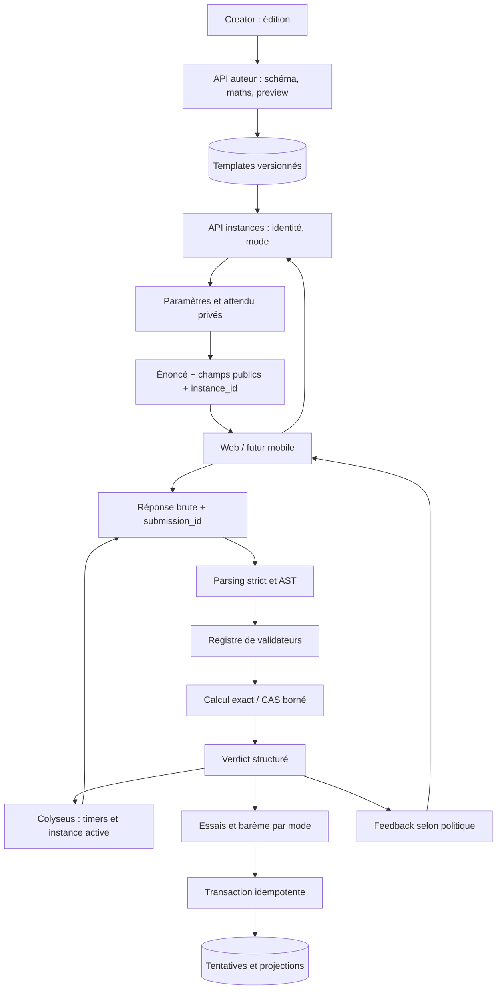

# 05 — Architecture cible recommandée

Proposition du 9 octobre 2026. Rien n'est implémenté. Le diagnostic est fondé sur `frontend/app/utils/math/evaluation.ts`, `ExerciseLoader.tsx`, `duel-server/src/rooms/DuelRoom.ts.handleSubmitAnswer`, `backend/routers/ds.py.ds_submit`, `chapter_placement_test.py.get_next_test_exercise` et les producteurs Creator décrits dans [01](current-architecture.md).

## Choix : moteur backend et petit registre de validateurs

Centraliser **instanciation, correction et attribution autorisée** dans le FastAPI existant. Employer quelques validateurs spécialisés (nombre exact/approché, fraction/forme, expression, intervalle, ensemble fini, texte, QCM). Un simple mapping type → fonction suffit ; pas de framework de plugins ou microservice supplémentaire.

Le frontend reste responsable de saisie, rendu et interactions ; son éventuel parsing local améliore l'UX, sans autoriser points/résultat durable. Creator réutilise les mêmes contrats et endpoints de validation/preview. Colyseus garde timers, scores de match et synchronisation, mais n'accepte plus le booléen client comme preuve. L'intégration au moteur ne doit pas introduire un second écrivain du score duel.

| Option | Simplicité / fiabilité / tests | Performance / compatibilité / mobile |
|---|---|---|
| A. Factoriser architecture actuelle TS | Faible coût initial ; helpers communs et tests améliorent qualité ; verdict toujours falsifiable si client autorité ; besoin de remplacer sampling | Pas de réseau ajouté ; portage Creator/duel partiel ; application native doit réimplémenter ou embarquer TS |
| B. Moteur central backend unique | Modéré ; un seul service autorisé, CAS disponible en Python ; tests isolés et erreurs structurées ; réseau et contrôle ressources à prévoir | Compatible natif par HTTP ; adaptateurs legacy ; réduit divergences de mode ; charge CPU centrale |
| C. Registre de validateurs spécialisés | Cohérent avec B, pas alternative de déploiement ; exactitude adaptée à chaque format et tests par règle | Extensible sans solveur universel ; pas de CAS pour QCM/text ; conversion progressive format par format |

Recommandation **B + C**, avec adaptateur legacy explicite et familles mathématiques bornées. A convient comme étape de caractérisation mais ne résout ni intégrité ni cohérence Creator. Les barèmes restent séparés par mode : pratique, positionnement, DS et duel n'ont pas les mêmes objectifs.

## Organisation proposée, proportionnée

```text
backend/correction/
  contracts.py            # requêtes/résultats, politiques versionnées
  legacy.py               # lecture des conventions observées
  instances.py            # instanciation, paramètres, contraintes
  parsing.py              # ASCII/LaTeX -> AST scolaire strict
  math_engine.py          # opérations exactes et CAS contrôlé
  validators.py           # petit registre et validateurs par type
  service.py              # orchestration et règles d'essai/feedback
  repository.py           # lecture templates, tentative/transaction
backend/routers/correction.py
```

Ces noms sont proposés ; créer uniquement les modules nécessaires au premier type migré. Séparer les validateurs en fichiers seulement si leur taille le justifie. Aucune infrastructure distribuée générale ni DSL auteur arbitraire n'est recommandée.

- Parsing : liste explicite des opérateurs/fonctions/noms ; rejet de tout caractère/nœud hors langage. L'AST conserve forme d'entrée pour vérifications pédagogiques ; n'utilise pas une chaîne de code comme représentation.
- Instanciation : graphe de dépendances computed ; détecter cycles et contraintes impossibles ; erreurs bloquent l'instance ; paramètres numériques exacts ; RNG seed/version pour reproduction ; aucun fallback exclu.
- Math engine : comparer scalaires exacts, polynômes/rationnels, expressions autorisées ; gérer domaines/hypothèses avant simplification. Ne pas lancer solve sur toute réponse si solution déjà configurée.
- Validateurs : distinguer syntaxe, domaine, valeur, forme ; set ignore ordre, tuple futur le conserve ; interval vérifie crochets/bornes et domaine réel.
- Service : traite essai/skip/abandon/finalisation ; génère diagnostic pour élève et trace interne ; l'échec technique n'est pas un verdict incorrect.
- Repository : vérifie propriétaire/mode/version/instance ; récupère difficulté/compétences côté serveur ; transaction et idempotence. Éviter les read-modify-write non atomiques présents dans Loader et DS.
- Feedback : texte/localisation et LaTeX dérivés du résultat certifié, sans repasser dans cleanMathExpression ; politique de révélation selon mode.
- Creator : choix de règles basés sur capacités du service, validation avant publication et test d'une instance avec même pipeline ; détection de blocs que client élève ne sait pas afficher.

## Flux cible



DB conserve l'attendu privé. Le payload public retire correctAnswer/answer/options.correct et computed qui révéleraient directement la réponse. Ne pas confondre formule nécessaire à l'énoncé et solution privée : projection par contrat, pas blacklist improvisée. Les flags et métadonnées publiques doivent rester compatibles.

## Interfaces proposées

Exemple de contrat d'auteur v2, à finaliser après corpus :

```json
{
  "correction_version": 2,
  "answer": {
    "kind": "expression",
    "expected": "2*(x+1)",
    "symbols": {"x": {"domain": "real"}},
    "domain": "real",
    "comparison": "identity_on_domain",
    "required_form": "any"
  },
  "attempt_policy": {"max_attempts": 2}
}
```

Cet exemple illustre les concepts, pas une grammaire de domaines à exécuter comme code. Garder kind de réponse distinct du type de bloc et de la représentation LaTeX/ASCII. Hypothèses et domaines doivent être des données validées (ex. intervalle structuré), pas des instructions libres.

- `POST /api/exercise-instances` : exercise_id sous forme chaîne pour bigint, mode et contexte DS/duel ; serveur vérifie éligibilité puis crée instance_id et lie template/version/paramètres/utilisateur.
- `POST /api/exercise-instances/{id}/answers` : element_id, submission_id unique, raw_answer, input_syntax. Aucun isCorrect, score, expected, difficulté ou compétences venant du client ne fait autorité.
- Résultat : `status` parmi correct/incorrect/invalid_input/domain_error/undetermined/invalid_exercise/resource_limit ; reason_code, validité de forme, remaining_attempts, état de complétion, feedback permis ; score_delta seulement après transaction autorisée.
- Skip/abandon : action explicite avec identifiant idempotent, pas answer=false ni calcul !hasErrors.
- `POST /api/authoring/validate` et preview : mêmes contrats et engine, autorisation auteur ; ne pas écrire automatiquement.
- Duel : lien room/exercise_sequence/instance ; évaluer seulement l'instance active du joueur ; ne jamais router une réponse tardive vers nouvel exercice. Colyseus attribue le point après verdict signé/interne et politique de complétion, à une seule place.

Erreurs malformées : retour client identifiable sans traceback/secret ; journaux minimaux avec codes, instance/version et durées, pas données personnelles ou expressions énormes. Rejeter replay/submission_id divergent de payload, et double soumission ne donne jamais double récompense.

## Comparaison des bibliothèques

Inventaire actuel : mathjs pour calcul élève, mathlive pour saisie, KaTeX pour rendu ; Python sans SymPy ; Creator parseur maison et Math/JS. Ne pas garder les fonctions dynamiques Creator comme moteur de confiance.

| Outil | Utilité adaptée | Limite / recommandation |
|---|---|---|
| mathjs déjà installé | Calcul numérique, AST TS, graphes ; transition/characterization | Le parseur est riche, il faut limiter capabilities/AST et ressources. L'heuristique actuelle de sampling appartient à Novlearn, pas une garantie mathjs. Conserver pour UI/graphe si nécessaire. |
| SymPy | Rationnels exacts, polynômes, simplifications et ensembles côté Python | Bon candidat pour le calcul du backend existant, sous langage restreint ; domaines/hypothèses explicités ; résultats non conclusifs possibles. Prototype borné sur corpus avant adoption. |
| Cortex Compute Engine | Parser LaTeX/MathJSON et calcul JS ; proximité avec MathLive | Alternative à évaluer si coût du parsing LaTeX domine ; toute identité ne devient pas une preuve ; duplication CAS TS/Python à éviter. Pas ajouter deux moteurs complets par défaut. |
| Parseur maison Creator | Petit langage arithmétique autorisé | Utile comme point de comparaison, mais maintenance, domaines et exactitude restent à assurer ; ne couvre pas les réponses ensemble/interval. |
| KaTeX / MathLive | Rendu / saisie | Ne certifient pas vérité, domaine ou scoring. Leur succès visuel n'est pas validation de publication. |

La documentation officielle SymPy explique que == est structurel et propose comparaison par différence simplifiée selon cas ; cela ne dispense pas d'hypothèses ou du contrôle du domaine. [SymPy — égalité et pièges](https://docs.sympy.org/latest/explanation/gotchas.html).

**Sécurité SymPy** : ne pas transmettre les chaînes élève à parse_expr ou sympify sans validation ; parse_expr utilise eval. Construire uniquement les objets SymPy autorisés depuis AST validé, symboles explicitement déclarés, et jamais des attributs/appels Python ouverts. `evaluate=False` ne constitue pas une sandbox. [SymPy — parsing](https://docs.sympy.org/latest/modules/parsing.html).

**Sécurité mathjs** : instance limitée, whitelist de nœuds, fonctions interdites et borne des ressources ; ne pas prétendre que try/catch impose une durée. [mathjs — sécurité](https://mathjs.org/docs/expressions/security.html).

**Cortex** : distinguer égalité structurelle, valeur et identité ; isEqual peut être indéterminé, isIdenticallyEqual peut utiliser sampling. Le verdict doit transporter cette distinction au lieu de convertir toute vérité heuristique en preuve. [Compute Engine — comparaison symbolique](https://mathlive.io/compute-engine/guides/symbolic-computing/).

Ces recommandations reposent sur documentation officielle consultée le 9 octobre 2026 ; versions/API à figer lors du prototype, aucune dépendance ajoutée ici. Solutions locales open source sans service payant nécessaire.

## Limites mathématiques assumées

Commencer par rationnels, polynômes et expressions usuelles strictement bornées. Une identité peut être indécidable/non conclue dans le budget : retourner undetermined, sans pénaliser l'élève ni attribuer un point définitif. Les sondes numériques peuvent produire un contre-exemple ; leur réussite ne suffit pas universellement à preuve.

Pour f=(x-1)/(x-1) contre 1, conserver la restriction originale x!=1 **avant** annulation. Si l'énoncé demande fonction sur R, refuser ; si domaine déclaré R privé de 1, comparer sur celui-ci. Pour sqrt(x²), l'hypothèse x>=0 est essentielle. Distinguer nombres exacts et résultats approchés ; appliquer une tolérance seulement au format approché, avec abs/rel et règle d'arrondi validées.

La forme fraction irréductible/factorisée/développée doit être inspectée sur AST original après vérification de valeur. Canonicaliser trop tôt ferait disparaître la preuve de forme. La liste ordonnée de coordonnées ne doit pas devenir un set.

## Performance et déploiement

Actuel : expression implique jusqu'à 12 paires de parses/évaluations (10 pour inconnues entières), substitue/nettoie à chaque point. Aucun cache de compilation dans checkExpression ; GraphRenderer compile déjà avant échantillonnage. Creator regen à changement des variables ; preview et élève ne partagent pas l'instance. getRandomExercise du duel lit toute la sélection flash à chaque nouvel exercice ; coût réseau linéaire au pool. updateCompetenceScore lit puis écrit chaque compétence ; DS répète des writes. Pas de mesure de charge effectuée : pas de SLA existant certifié.

Cible :
- Prévalider/parsing du template à publication ; pré-calculer attendu une fois **par instance**. Cache borné clé hash template+version engine+paramètres+hypothèses ; jamais cache du verdict selon saisie brute seule.
- FastAPI ne doit pas exécuter un CAS synchrone coûteux sur son event loop. Employer un petit pool de processus borné avec timeout dur, mémoire et limites AST/nombre de chiffres/exposants/profondeur ; tuer/recréer processus bloqué. Un thread + wait_for ne suffit pas à stopper CPU.
- Les types simples n'ont pas besoin de CAS général. Pas de Kafka/queue distribuée au départ ; backpressure et refus temporaire si capacité saturée.
- Mesurer p50/p95/p99 par type et cache, temps CAS, timeout et débit simultané sur corpus privé. Objectif indicatif à confirmer : correction simple p95 <300 ms côté service ; expérience totale tient compte réseau et temps duel.
- Sélection duel : pool d'IDs éligibles et cache TTL borné envisageables après mesures ; assurer invalidation/version. Aucun surcoût de téléchargement de toutes les solutions.
- Transaction courte après calcul ; idempotence ; invalidation/reload cohérent. Une instance ne change pas quand template est édité.
- Préparer frontend progress/pending et retry technique ; aucun deuxième essai compté sur retry réseau.

## Critères de réussite de la cible

Contrats et domaines compréhensibles par auteur ; instance reproductible ; faux positifs confirmés corrigés par décisions explicites ; conformité Creator/web/duel ; aucun verdict client faisant autorité ; résultats durables rejouables sans secrets ; pas de points doublés ; unknown/timeout distinct d'incorrect ; corpus legacy et politiques de mode validés avant effacement ancien moteur.
